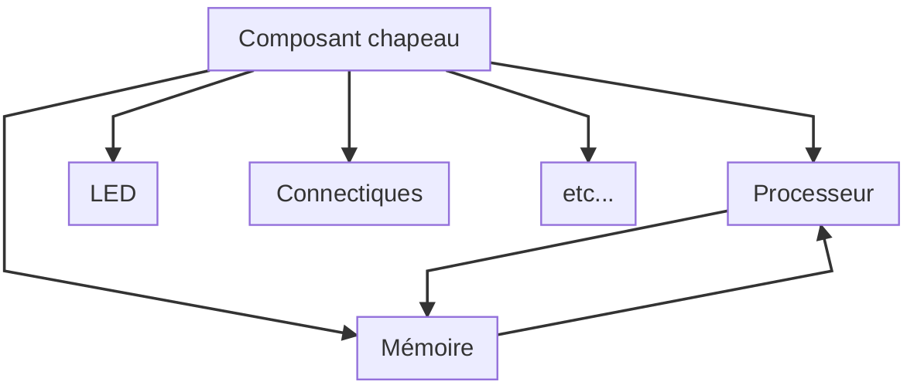
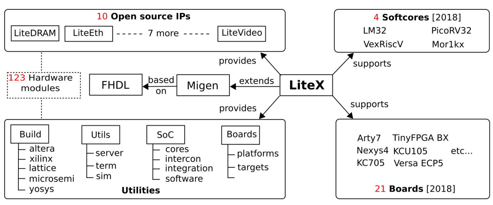
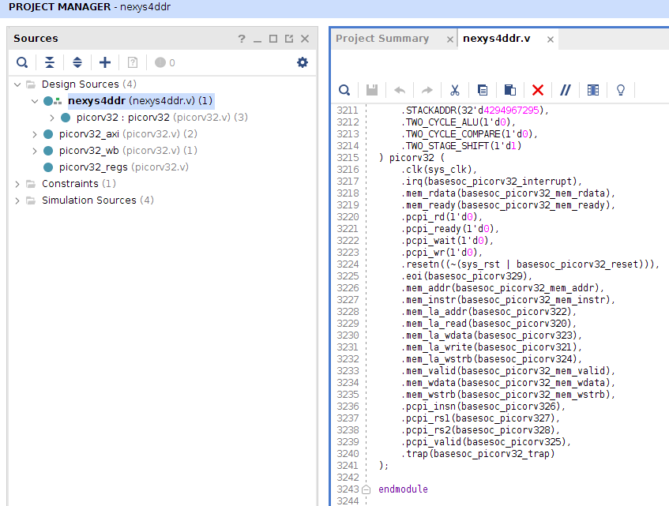
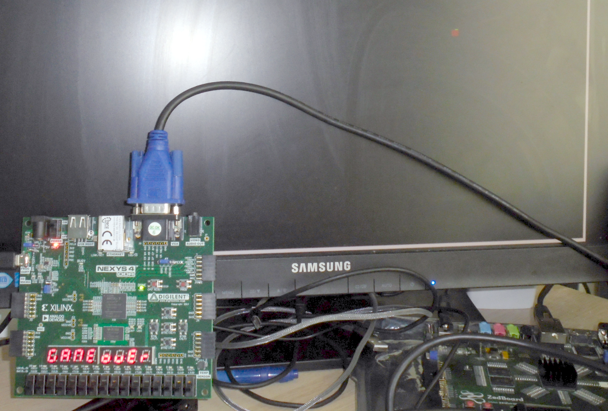

# LiteX : le framework open-source pour programmer du matériel en Python

> Auguste Durand, Sylvain Leylde - Etudiants ENSTA Bretagne
>
> Pascal Cotret, Jean-Christophe Le Lann - Enseignants/chercheurs ENSTA Bretagne

## Introduction

Les programmes quels qu'ils soient s'exécutent sur une plateforme matérielle après compilation : il peut s'agir d'un processeur (ARM, Intel, etc) ou d'un microcontrôleur enfoui au sein d'un objet connecté.

Le développement de la plateforme matérielle est un exercice particulier. C'est pour cela qu'on réalise généralement des prototypes sur un composant de type FPGA ou *Field-Programmable Gate Array*, disponibles dans des kits de développements peu onéreux (voir l'excellent article de Fabien Marteau dans Hackable n°31 **[1]**). Le FPGA a la capacité d'être reconfigurable : on peut donc personnaliser notre modèle de processeur et la plupart des composants associés (connectiques, contrôleurs mémoire, etc) jusqu'à en avoir une version suffisament performante pour pouvoir être fabriquée chez un fondeur.

Le développement sur les composants FPGA fait appel à des langages bien spécifiques mais nous allons voir dans cet article qu'il existe des alternatives utilisant des langages généralement dédiés au développement logiciel qui permettent de combiner le meilleur des deux mondes pour un développement rapide et accessible au plus grand nombre.

## Description classique du matériel

Lorsqu'on s'intéresse au développement de matériel, il existe deux langages principaux que sont le VHDL et le Verilog (pour plus d'informations, allez jeter un oeil à **[9]**) : on les appelle des HDLs (*Hardware Description Languages*, on utilisera plus facilement ce nom dans la suite de l'article). Pour illustrer leur syntaxe, nous allons regarder des exemples de codes qui décrivent une LED qui clignote (le "Hello world" du monde matériel).

### Un composant simple : la LED clignotante

En VHDL :

```vhdl
library IEEE;
use IEEE.std_logic_1164.ALL;
entity led_vhdl is
    port(clk : in  std_logic;
         led : out std_logic);
end led_vhdl;
architecture rtl of led_vhdl is
    signal compteur : integer range 0 to 25000000;
	signal led_temp : std_logic:='0';
begin
    process(clk)
    begin
        if(rising_edge(clk)) then
            compteur <= compteur+1;
        	if(compteur=24999999) then
            	compteur <= 0;
        		led_temp <= not led_temp;
    		end if;
  		end if;
	end process;
	led<=led_signal;
end rtl;
```

En Verilog :

```verilog
module blink (clk, led);
input clk;
output led;
reg [31:0] compteur;
reg led_temp;
initial begin
compteur <= 32'b0;
led_temp <= 1'b0;
end
always @ (posedge clk)
    begin
        compteur <= compteur + 1'b1;
        if (compteur > 50000000)
            begin
                led_temp <= !led_temp;
                compteur <= 32'b0;
            end
    end
    assign led = led_temp;
endmodule 
```

Le code se compose de deux parties principales :

- Le "prototype" qui contient les entrées/sorties du système : l'`entity` en VHDL (respectivement le `module` Verilog).
- Le coeur de la fonction, décrit dans l'`architecture` délimitée par les mots clés `architecture...begin` et `end architecture` (respectivement `module` / `endmodule` en Verilog).

Le VHDL et le Verilog sont des langages qui sont structurels par essence. Autrement dit, on décrit un assemblage de fonctions simples : dans les codes ci-dessus, il s'agit d'un compteur et de la fonction qui permet d'allumer et d'éteindre une LED. Fort heureusement, il existe des bibliothèques de composants élémentaires qui peuvent être instanciés dans un composant plus complexe pour faciliter la tâche du développeur.

Un des points importants des HDLs est leur parallélisme. Un processeur classique est séquentiel : il prend une instruction, la décode et l'exécute; plusieurs instructions peuvent être traitées en parallèle si le processeur est pipeliné. Un composant développé dans un HDL est, quant à lui, parallèle dans le sens où les fonctions élémentaires qui le composent sont exécutées en parallèle.

- Lors d'une simulation, on doit donc émuler un code parallèle pour qu'il s'exécute sur un processeur séquentiel (voir le paragraphe "Emulation du parallélisme" **[9]**).
- Le développeur doit avoir une vue assez précise de l'interaction temporelle entre les différents composants, même s'il existe des mécanismes qui permettent de faciliter la tâche (la synchronisation, par exemple).

### Passage à un System-on-Chip

Dès lors qu'on a construit nos fonctions élémentaires, il est possible de construire des éléments plus complexes comme un [processeur](https://riscv.org/). Ceci dit, un processeur seul ne suffit pas à créer un système sur puce (SoC ou *System-on-Chip*) capable de faire tourner votre OS préféré : il faut y ajouter de la mémoire, des connectiques (vidéo, USB), de quoi afficher, du Wifi ou du Bluetooth, etc.

Avec un HDL, l'assemblage de fonctions élémentaires se fait à l'aise d'un composant "chapeau" (en anglais, on parlera de composant **top level**) et peut se représenter sous la forme suivante :



Pour continuer sur l'analogie avec le monde des ordinateurs, le composant chapeau est en quelque sorte la carte mère du système complet : il définit les connexions entre les fonctions élémentaires. Pour celles et ceux qui sont adeptes des langages de programmation orientés objet, on peut voir cela comme suit :

- Chaque composant est défini dans une "classe".
- La classe **Composant chapeau** instancie des objets des classes **Processeur**, **Mémoire**, etc.

L'élaboration du schéma de connexion est assez souvent à la charge du développeur. Au delà des contraintes liées à la syntaxe du langage, il doit avoir conscience de plusieurs facteurs :

- L'interaction physique entre les composants (est-ce que le processeur a le droit de lire dans la mémoire DDR ?).
- La gestion des horloges qui cadencent les différents blocs.
- L'organisation mémoire à l'intérieur du SoC : taille des mémoires et des caches, *memory mapping* des différents composants (à quelle adresse est accesible la mémoire DDR our le port HDMI).

L'exerecice est potentiellement complexe quand on souhaite assembler des composants hétérogènes venant de sources diverses. C'est une des raisons pour lesquelles ce type de développement est réservé à des ingénieurs *hardware*. Heureusement, il existe des alternatives qui permettent d'automatiser certaines de ces tâches et les environnements de développement matériel tenden à proposer des outils rendant accesible le développement matériel à des personnes venant du développement logiciel. 

## Description du matériel avec des langages alternatifs

La majorité des langages de programmation n'est pas verouillé à un domaine applicatif donné. En ce qui concerne le développement matériel, il existe des langages dédiés également appelés DSLs (*Domain Specific Language*) qui sont plus haut-niveau que les HDLs traditionnels mais qui permettent tout de même de produire du code compilable pour les circuits matériels : on peut citer par exemple [Chisel](http://www.fabienm.eu/flf/hdl/chisel/) et [SpinalHDL](http://www.fabienm.eu/flf/category/langages/spinalhdl/) (un fork).

### Compilation du matériel

Pour pouvoir être exécutés sur un circuit FPGA, le code HDL passe par un processus dit de *synthèse* qui permet de passer du code à un bitstream qui est le fichier final téléchargé sur le circuit FPGA (cette étape est analogue à la compilation où on passe d'un code source à un binaire prêt à être exécuté). 

Pour les DSLs tels que Chisel, c'est un peu différent car on passe par une [représentation intermédiaire](https://github.com/freechipsproject/firrtl). Autrement dit, la synthèse Scala => bitstream n'est pas directe :


### Chisel vs. HDLs

Voici un exemple de code faisant clignoter une LED en [Chisel](https://github.com/schoeberl/comphdl/blob/master/chisel/src/example/Blink.scala) :

```scala
class Hello extends Module {
    val io = IO(new Bundle {
        val led = Output (UInt (1.W))
    })
    val CNT_MAX = (50000000 / 2 - 1).U;
    val cntReg = RegInit (0.U(32.W))
    val blkReg = RegInit (0.U(1.W))
    cntReg := cntReg + 1.U
    when(cntReg === CNT_MAX) {
        cntReg := 0.U
        blkReg :=  ̃ blkReg
    }
    io.led := blkReg
}
```

Chisel (et son fork SpinalHDL) ont contribué, à leur manière, à une certaine évolution dans l'implémentation de composants matériels. Chisel et SpinalHDL sont basés sur Scala qui est un langage de programmation multi-paradigmes (programmation orientée objet et programmation fonctionnelle). Contrairement aux HDLs traditionnels, Scala est connu pour la permissivité de sa syntaxe :

- Les point-virgules sont optionnels en fin de ligne.
- Chaque méthode peut-être utilisée en notation infixe : les notations `"%d pommes".format(num)` et `"%d pommes" format num` sont équivalentes.

Les avantages de Scale sur les HDLs traditionnels vont bien au-delà d'une amélioration de syntaxe : on peut également utiliser les propriétés d'inférence de types (le compilateur se débrouille à trouver le type le plus adéquat pour une donnée ou une variable) ou les générateurs. **Ces propriétés n'existent pas nativement dans les HDLs mais sont pourtant très utiles !**

## Et pourquoi pas le Python ?

Il existe des solutions dans d'autres langages. Xilinx et Intel, les 2 principaux constructeurs de FPGA, utilisent le langage C++ (voir l'article de Patrice Kadionik dans HK29 **[3]**); d'autres solutions sont disponibles en Python ([MyHDL](http://docs.myhdl.org/en/stable/manual/preface.html), Migen+LiteX). Le framework Migen+LiteX a une communauté assez importante et grandissante (tout est open-source !), nous allons donc nous intéresser à cette option dans le reste de l'article

### Migen+LiteX

Migen est une boîte à outils en Python, basée sur un arbre de syntaxe abstraite, qui contient une bibliothèque de composants et même un simulateur. Tout comme les DSLs décrits précédemment, le code peut être transformé en VHDL ou Verilog, les langages historiques pour le développement matériel. Cependant, Migen ne fait pas appel à de la programmation évenementielle qu'on retrouve dans la plupart des HDLs ou d'autres langages de programmation classiques (notamment pour la construction de GUI). Par contre, Migen apporte des notions de logique combinatoire et synchrone qui sont des notions essentielles dans le développement matériel.

LiteX (basé sur Migen) va un peu plus loin en proposant un mécanisme de construction de SoC et un nombre grandissant de composants décrits en HDL (VHDL ou Verilog) mais avec un wrapper écrit en Python qui permet de les connecter au reste du système.

### Exemple de code Migen/LiteX

```python
# On créé un module (représente le circuit FPGA)
module = Module()
# Un compteur 26 bits et une LED qui clignote
counter = Signal(26)
module.comb += led.eq(counter[25])
module.sync += counter.eq(counter + 1)
```

Ici, nous avons affaire à un code simple qui implémente un compteur et une LED qui clignote : le code utile ne prend que 3 lignes ! (légèrement moins que les codes VHDL/Verilog présentés au début de l'article). De plus, en ce qui concerne la syntaxe, les aficionados de Python ne seront pas dépaysés :

| LiteX    | HDL                                       | Description                                                  |
| -------- | ----------------------------------------- | ------------------------------------------------------------ |
| `Module` | `entity` (VHDL) ou `module` (Verilog)     | Le module est l'élément de haut-niveau dans lequel on va instancier les éléments de notre SoC |
| `Signal` | `signal` (VHDL) ou `reg`/`wire` (Verilog) | Autrement dit, une variable intermédiaire                    |

- La méthode `eq` permet d'affecter une valeur à une variable.
- Pour rappel, Migen propose des notions de logique combinatoire et synchrone : cela correspond aux attributs `comb` et `sync` dans le code ci-dessus.

Bien que le code ci-dessus présente un bloc simple, la communauté Migen/LiteX a contribué à proposer un framework complet :



Une fois qu'on a notre module, on peut facilement connecter plusieurs modules entre eux (notre LED, un processeur dit *softcore*, de la vidéo, de l'Ethernet...) afin de créer notre propre système embarqué capable de faire tourner un petit noyau (mais chut, on verra ça plus tard :wink:). Tout comme les approches DSL Chisel/SpinalHDL, LiteX ne s'interface pas directement avec le circuit FPGA sur lequel notre système tournera : par conséquent, LiteX va convertir tout le code Python en HDL et ce dernier sera synthétisé/compilé pour la carte de développement qu'on aura choisi. Pour certains composants comme les processeurs, LiteX ira cloné le dépôt contenant le code HDL et le développeur n'aura qu'à instancier un objet équivalent dans son code Python.

Bref, on se retrouve avec un langage orienté objet bien connu et facile à prendre en main pour construire notre propre système embarqué ! Pour illustrer le flot de développement, nous allons voir comme cela se goupille sur un projet étudiant qu'on a réalisé à l'ENSTA Bretagne où on a codé une plateforme multi-usage (dont un jeu type Snake :snake:)

## Cas d'étude - Implémentation d'un système complet pour un jeu type Snake

Pour réaliser notre système capable de faire tourner un jeu type Snake, nous utiliserons la carte FPGA [Nexys 4 DDR](https://reference.digilentinc.com/reference/programmable-logic/nexys-4-ddr/start) qui a l'avantage d'avoir un ensemble de connectiques assez complet pour une plateforme orientée démonstration. Le flot de conception avec Migen/LiteX est semblable à celui utilisé traditionnellement avec un HDL :

- Définition de l'architecture : quel processeur ? Combien de mémoire ?
- **Spécifique à LiteX : transformation Python => HDL**
- Définition du logiciel : quel OS ? Qu'est-ce que doit faire le programme principal ?
- Synthèse du matériel.
- Compilation du logiciel.
- Téléchargement du tout sur la carte.

En ce qui concerne l'architecture matérielle qu'on va implémenter sur le FPGA, nous allons avoir besoin des élements suivants :

- Un processeur (pas besoin d'un Intel dernière génération).
- Un peu de mémoire pour stocker le code.
- Un joystick pour piloter notre serpent.
- Pour l'affichage, un bon vieux VGA et des afficheurs 7 segments pour afficher d'autres choses (score, message, etc).
- Un bus de données pour que tous ces éléments puissent communiquer entre eux.


### Développement du matériel

Pour développer l'architecture présente dans la figure ci-dessus, on va devoir s'attaquer au Python. Le code complet est disponible ici : https://github.com/pcotret/RISCV/blob/master/DEV/buildNexys4ddr.py. En guise d'exemple, prenons le sous-ensemble minimal dont on aurait besoin pour jouer à Snake : on aurait donc besoin d'un processeur, d'un joystick et d'une sortie vidéo.

```python
class BaseSoC(SoCCore):
	def __init__(self):
		platform = nexys4ddr.Platform()
		# SoC with CPU
		SoCCore.__init__(self, platform,
 			cpu_type="picorv32",
			clk_freq=100e6,
			integrated_rom_size=0x8000,
			integrated_main_ram_size=16*1024)
		#
		# [...]
		# 
		# Joystick SPI
		SoCCore.add_csr(self,"joystick")
		self.submodules.joystick = spijoystick.SpiJoystick(platform.request("joystick"))
		# VGA
		SoCCore.add_csr(self,"vga_cntrl")
		vga_red = Cat(*[platform.request("vga_red", i) for i in range(4)])
		vga_green = Cat(*[platform.request("vga_green", i) for i in range(4)])
		vga_blue = Cat(*[platform.request("vga_blue", i) for i in range(4)])
		self.submodules.vga_cntrl = vgacontroller.VGAcontroller(platform.request("hsync"),platform.request("vsync"), vga_red, vga_green, vga_blue)
```

- On commence tout d'abord par le processeur (`SoCCore.__init__`) : on peut choisir plusieurs caractéristiques telles que le type (ici un PicoRV32), sa fréquence, la taille des mémoires, etc.
  - L'installation de LiteX aura téléchargé le code permettant d'instancier un processeur 100% HDL dans un module Python https://github.com/litex-hub/pythondata-cpu-picorv32
  - Le code HDL des processeurs est régulièrement mis à jour par la communauté : on est donc à peu près sûrs d'avoir un CPU récent.
  - Selon les tailles passées dans le constructeur, LiteX instanciera les blocs mémoires en conséquence dans la limite du possible (la quantité de mémoire disponible dans les circuits FPGA est souvent limitée...).
- On ajoute ensuite un joystick avec le protocole SPI et le VGA pour la vidéo.
  - Pour des protocoles classiques, la description est faite directement en Python. Pour le SPI, rien de plus simple : on retrouve les 4 signaux du protocole MOSI/MISO/SCLK/SS https://github.com/pcotret/RISCV/blob/master/DEV/module/spijoystick.py

On s'aperçoit qu'il est facile d'ajouter des composants par la suite pour agrémenter notre plateforme : on rajoute un sous-module, on branche les signaux en Python et c'est réglé ! En plus, comme la communauté est très active, il existe déjà de nombreux composants. Si nous avions voulu faire une architecture équivalente avec un HDL traditionnel, il aurait fallu en plus penser au bus de données qui est souvent complexe : cette étape est complètement gérée en interne par LiteX :smile:



Un aperçu du code Verilog dans l'IDE dédié. `nexys4ddr` est le composant chapeau : il instancie le PicoRV32 (notre processeur), AXI et WB (bus de communication), des registres et les périphériques. **Les 76 lignes de [code Python](https://github.com/pcotret/RISCV/blob/master/DEV/buildNexys4ddr.py) génère plusieurs milliers de lignes de code Verilog (6289 pour être exact dans le cadre de cet exemple !).**

### Développement du logiciel

Maintenant qu'on a notre architecture matériel, il nous faut tout de même un bout de logiciel pour faire tourner notre jeu Snake. Le code principal de la plateforme de démonstration contient uniquement l'essentiel pour avoir un menu avec des options représentant les différentes applications disponibles : https://github.com/pcotret/RISCV/blob/master/DEV/firmware/main.c. Pour ce projet de démonstration, c'est du bare-metal, pas besoin de plus. Mais on peut mettre un vrai Linux :penguin: à base de Buildroot : https://github.com/litex-hub/linux-on-litex-vexriscv/tree/master/buildroot

```txt
--=============== SoC ==================--
CPU:       PicoRV32 @ 100MHz
ROM:       32KB
SRAM:      4KB
MAIN-RAM:  16KB

--============== Boot ==================--
Booting from serial...
Press Q or ESC to abort boot completely.
sL5DdSMmkekro
[LXTERM] Received firmware download request from the device.
[LXTERM] Uploading firmware/firmware.bin to 0x40000000 (12628 bytes)...
[LXTERM] Upload complete (3.7KB/s).
[LXTERM] Booting the device.
[LXTERM] Done.
Executing booted program at 0x40000000

--============= Liftoff! ===============--

RiscV project - CPU testing software built May 22 2020 15:11:07

Available commands:
help                            - this command
reboot                          - reboot CPU
display                         - display test
led                             - led test
knight                          - knight rider
switch                          - switch test
rgbled                          - rgb led test
joystick                        - joystick test
snake                           - snake onboard game
vga                             - vga test
RUNTIME>
```



(bien évidemment, le score était élevé avant d'atteindre le game over :wink:)

Si vous souhaitez reproduire la manipulation, tout le code est disponible sur Github : https://github.com/pcotret/RISCV

## Références

1. Fabien Marteau, HK 32, Des kits de développement FPGA à moins de 30€. https://connect.ed-diamond.com/Hackable/HK-032/Des-kits-de-developpement-FPGA-a-moins-de-30-EU
2. Fabien Marteau, HK 31, La liberté jusqu’au cœur du processeur avec RISC-V. https://connect.ed-diamond.com/Hackable/HK-031/La-liberte-jusqu-au-coeur-du-processeur-avec-RISC-V
3. Patrice Kadionik, HK 29, Créez simplement votre périphérique matériel avec le langage C. https://connect.ed-diamond.com/Hackable/HK-029/Creez-simplement-votre-peripherique-materiel-avec-le-langage-C
4. Sébastien Bourdeauducq, GLMF 149, Migen, une « boîte à outils » en Python pour concevoir des circuits logiques complexes. https://connect.ed-diamond.com/GNU-Linux-Magazine/GLMF-149/Migen-une-boite-a-outils-en-Python-pour-concevoir-des-circuits-logiques-complexes
5. Denis Bodor, OS 6, FPGA, HDL et Linux : petite mise en bouche pratique. https://connect.ed-diamond.com/Open-Silicium/OS-006/FPGA-HDL-et-Linux-petite-mise-en-bouche-pratique
6. Dominique Taboureux, OS 9, Introduction au langage VHDL par l'exemple. https://connect.ed-diamond.com/Open-Silicium/OS-009/Introduction-au-langage-VHDL-par-l-exemple
7. https://github.com/enjoy-digital/litex
8. Kermarrec et al, [LiteX: an open-source SoC builder and library based on Migen Python DSL](https://osda.gitlab.io/19/1.1.pdf)
9. Cours de Télécom ParisTech : https://hdl.telecom-paristech.fr/