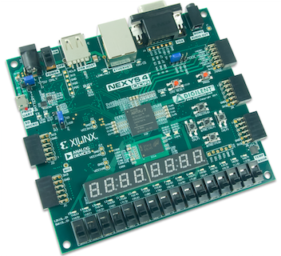

# NEXYS4DDR  et PICORV32

La carte mise à disposition par l'école pour ce projet est une Nexys4DDR équipée d'un FPGA de chez Xilinx, dont les liens vers la documentation et la description sont listés ci-après. Sachant cela et après avoir analyser les différents projets RiscV nous avons opté pour l'implémentation d'un processeur PicoRV32 car ce processeur est bien documenté mais surtout, il fait parti des COREs disponible sur le Git de Litex.

Mis à part l'installation des drivers de vivado (voir en bas de page), indispensable pour s'interfacer avec la carte, le reste de l'implémentation sera open-source. A noter que la suite Vivado est déjà disponible sur les ordinateurs de l'école.

#### RISCV_PICORV32:

lien vers le github :https://github.com/cliffordwolf/picorv32 

et l'implémentation de Litex: https://github.com/enjoy-digital/litex/tree/master/litex/soc/cores/cpu/picorv32

#### FPGA:

Le FPGA utilisé pour ce projet est un Artix-7 de fourniture Xilinx:

https://www.xilinx.com/products/silicon-devices/fpga/artix-7.html#productTable

Voici ses caractéristiques principales:

#### DIGILENT:

la carte sur lequel est implémenté ce FPGA est une NEXYS 4 DDR de fourniture DIGILENT, voici le lien vers sa page de documentation générale:

https://reference.digilentinc.com/reference/programmable-logic/nexys-4-ddr/start

Le manuel de référence est diponible ici: https://reference.digilentinc.com/reference/programmable-logic/nexys-4-ddr/reference-manual

## Key Features

| **Feature**       | **Description**                                              |
| ----------------- | ------------------------------------------------------------ |
| FPGA              | XC7A100T-1CSG324C                                            |
| I/O Interfaces    | USB-UART for programming and serial communicationOne 10/100 EthernetUSB OTG 2.0USB-UART bridge12-bit VGA output3-axis accelerometerPWM audio outputTemperature sensorPDM microphoneUSB HID Host for mice, keyboards and memory sticks |
| Memory            | 128 Mbyte DDR2128 Mbit Serial FlashMicro SD card connector   |
| Displays          | 2 4-digit 7-Segment displays                                 |
| Switches and LEDs | 16 Slide switches16 LEDs2 tri-color LEDs5 Push-buttons       |
| Clocks            | One 100 MHz crystal oscillator                               |
| Expansion ports   | Pmod for XADC signals4 Pmod ports                            |

## VIVADO

Vivado est l'outil de développement mis à disposition par Xilinx, même si nous ne l'utilisons pas directement, Litex va en utiliser les composants pour builder notre architecture et ainsi générer le bitstream.

L'installation de Vivado ainsi que des drivers pour la carte  NEXYS 4 DDR est donc nécéssaire:

https://reference.digilentinc.com/vivado/installing-vivado/start

Attention, plus de 20go sont nécessaires..

