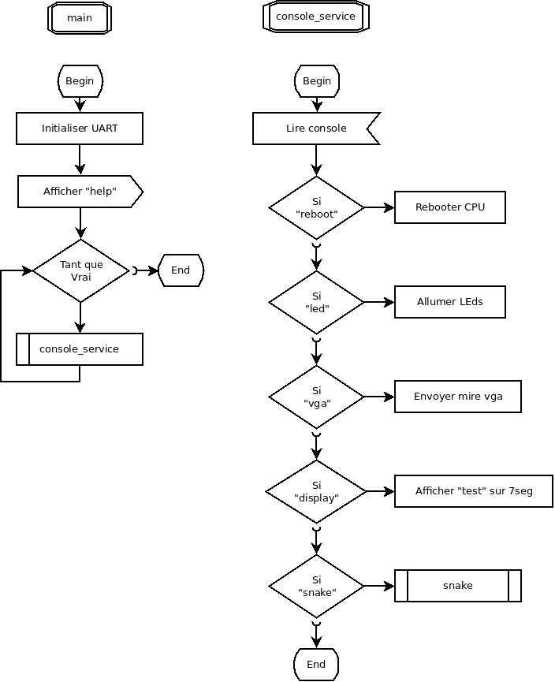
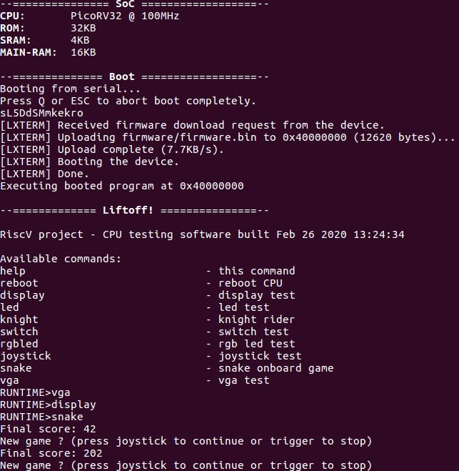
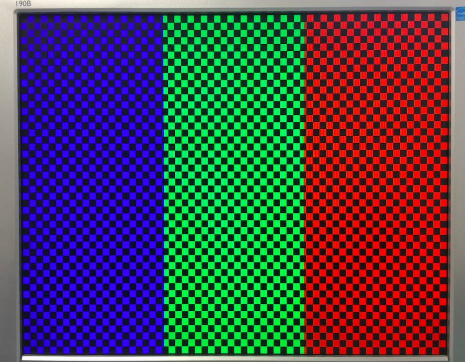
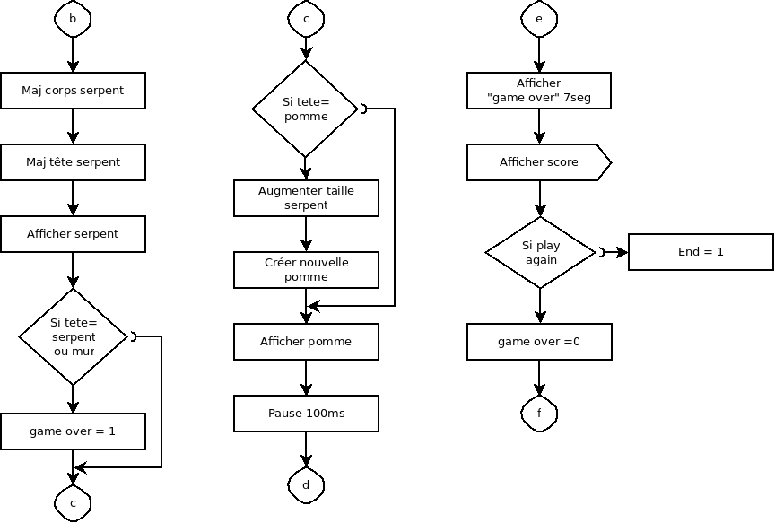
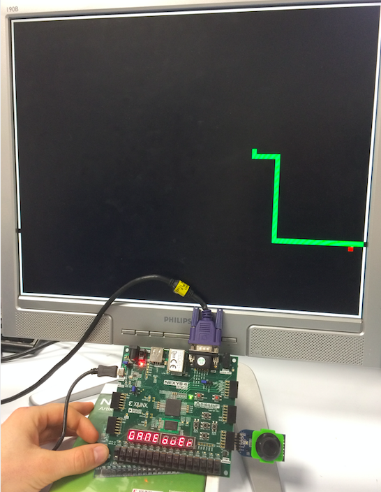

# Firmware

### Main
Une fois le bitstream généré et implémanté dans le FPGA, il devient possible de programmer le processeur.
Pour ce faire, nous nous sommes inspirés des leçons/tuto mis à disposition par litex (https://github.com/enjoy-digital/fpga_101). Ces tutos proposent un programme principal en C que l'on peut schématiser de la manière suivante:



Ce main permet de gérer la liaison UART avec un PC ainsi que d'effectuer de simples tests pour gérer les différents entrées/sorties. Ainsi, nous pouvons executer les fonctions via le terminal comme nous pouvons le voir sur la capture suivante :


Nous avons complété ce fichier main afin d'y intégrer le test de l'écran vga. On obtient ainsi la mire suivante:



### Snake
Nous avons décrit précédemment les modules de gestion des périphériques vga et spi. Afin d'évaluer l'implémentation de ces différents modules nous avons choisi de realiset un jeu snake sur un écran relié par vga avec un joystick. Pour ce faire, nous avons coder un algorithme en C execuable par le processeur dont voici le schéma de principe suivi du code C correspondant.




```c
void snake(void) {

	char flag_end = 0;
	unsigned char flag_over=0;
	
	unsigned char fsButtons=0;
	unsigned char stdPktValues [5];
	unsigned char rtrnValues [2];
	signed char joy_x,joy_y;
	
	char txt[8]; // for 7seg
	
	unsigned short thikness = 8;
	unsigned int x_rez = 640;
	unsigned int y_rez = 480;
	
	unsigned short sn_x[255], sn_y[255];
	unsigned char taille;
	
	unsigned short ap_x, ap_y;
	
	char mvt;	//1->left; 2->right; 3->up; 4->down
	
	int x,y;
	
	while(flag_end == 0) {
		// affichage fond
		for(y=0; y<y_rez; y++) {
			for(x=0; x<x_rez; x++) {
				vga_cntrl_mem_we_write(0);
				vga_cntrl_mem_adr_write(y*x_rez+x);
				vga_cntrl_mem_data_w_write(((y<(thikness/2)) || (y>=y_rez-thikness/2) || (x<(thikness/2)) || (x>=x_rez-thikness/2)) ? color_white : 0);
				vga_cntrl_mem_we_write(1);
			}
		}
		
		// maj 7segment
		sprintf(txt,"%c%c%c%c%c%c%c%c",display_G, display_A, display_M, display_E, 0, display_O, display_N, 0);
		display(txt);

		// init snake
		sn_x[0] = x_rez/2;
		sn_y[0] = y_rez/2;
		taille = 1;
	
		// init pomme
		ap_x = x_rez/4*3;
		ap_y = y_rez/2;
		
		// init mvt
		mvt = 0; 
		
		// boucle de jeu
		while(flag_over==0) {
			//lecture joystick
			getCommand(cmdGetPosition,2,stdPktValues,rtrnValues);
			fsButtons = stdPktValues[4];
			joy_x = rtrnValues[0]-128;
			joy_y = rtrnValues[1]-128;
	
			//choix mvt
			if((abs(joy_x)>=85)||(abs(joy_y)>=85)) {
				if(abs(joy_x)>=abs(joy_y)) mvt = ((joy_x>0) ? ((mvt==4) ? 4 : 3) : ((mvt==3) ? 3 : 4));
				else mvt = ((joy_y>0) ? ((mvt==1) ? 1 : 2) : ((mvt==2) ? 2 : 1));
			}
		
			//effacement motif
			for(y = sn_y[taille-1]-thikness/2; y<sn_y[taille-1]+thikness/2; y++) {
				for(x=sn_x[taille-1]-thikness/2; x<sn_x[taille-1]+thikness/2; x++){
					vga_cntrl_mem_we_write(0);
					vga_cntrl_mem_adr_write(y*x_rez+x);
					vga_cntrl_mem_data_w_write(0);
					vga_cntrl_mem_we_write(1);
				}
			}
		
			//maj corps serpent
			for(x=taille; x>0; x--){
				sn_x[x] = sn_x[x-1];
				sn_y[x] = sn_y[x-1];
			}
		
			//maj tete serpent
			switch(mvt) {
				case 1: // left //
					sn_x[0] -= thikness;
					break;
				case 2: // right //
					sn_x[0] += thikness;
					break;
				case 3: // up //
					sn_y[0] -= thikness;
					break;
				case 4: // down //
					sn_y[0] += thikness;
					break;
			}
		
			//affichage serpent
			for(y = sn_y[0]-thikness/2; y<sn_y[0]+thikness/2; y++) {
				for(x=sn_x[0]-thikness/2; x<sn_x[0]+thikness/2; x++){
					vga_cntrl_mem_we_write(0);
					vga_cntrl_mem_adr_write(y*x_rez+x);
					if(vga_cntrl_mem_data_r_read()==color_green || vga_cntrl_mem_data_r_read()==color_white){
						flag_over = 1;
					}
					else vga_cntrl_mem_data_w_write(color_green);
					vga_cntrl_mem_we_write(1);
				}
			}
		
			//Test Pomme
			if((sn_x[0]==ap_x) && (sn_y[0] == ap_y))
			{
				//augmenter taille serpent
				taille ++;
			
				//nouvelle pomme
				ap_x = (rand()%(x_rez/thikness-4)+2)*thikness;
				ap_y = (rand()%(y_rez/thikness-4)+2)*thikness; 
			}
		
			//affichage pomme
			for(y = ap_y-thikness/2; y<ap_y+thikness/2; y++) {
				for(x=ap_x-thikness/2; x<ap_x+thikness/2; x++){
					vga_cntrl_mem_we_write(0);
					vga_cntrl_mem_adr_write(y*x_rez+x);
					vga_cntrl_mem_data_w_write((y == ap_y-thikness/2) ? ((x < ap_x) ? color_black : color_bright_green) : color_red);
					vga_cntrl_mem_we_write(1);
				}
			}
		
			//delai de boucle
			delay_ms(100);
		}
	
		// maj 7segment
		sprintf(txt,"%c%c%c%c%c%c%c%c",display_G, display_A, display_M, display_E, display_O, display_V, display_E, display_R);
		display(txt);
	
		// retour du score
		printf("Final score: %d\nNew game ? (press joystick to continue or trigger to stop)\n", taille-1);
		
		// test play again
		while((fsButtons&(bitJstk+bitTrigger)) == 0){
			getCommand(cmdGetPosition,2,stdPktValues,rtrnValues);
			fsButtons = stdPktValues[4];
		}
		if(fsButtons&bitTrigger) flag_end = 1;
		if(fsButtons&bitJstk) flag_over = 0;
	}
}
```

### Demonstration
Une fois le programme du snake implémanté dans le FPGA, il ne rest plus qu'à jouer, record à battre 202 !

[](https://github.com/SylvainEnsta/RISCV/blob/master/Rapport/Images/Snake_Nexys4DDR.mp4)

(Cliquez sur l'image pour télécharger la vidéo)

